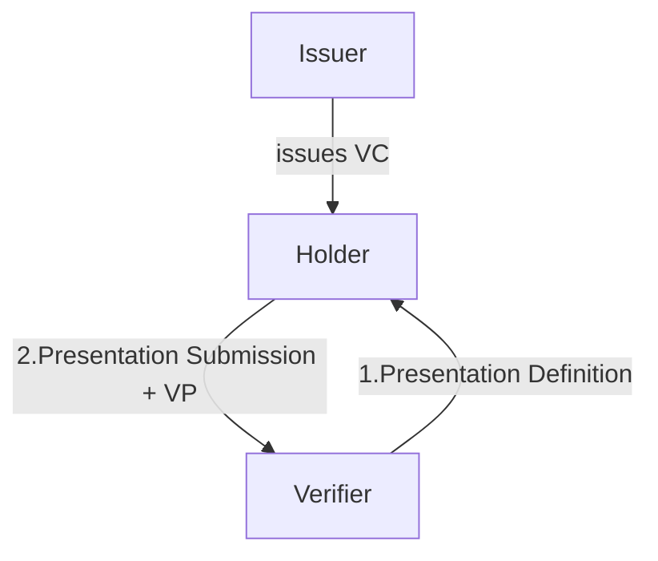

# Verifiable Credentialsにおけるクエリ言語の比較：DCQLとPresentation Exchange

本稿では、Verifiable Credentials (VCs) エコシステムにおける主要な2つのクエリ言語、Digital Credential Query Language (DCQL) と Presentation Exchange (PE) を比較検討する。両者の特徴、構文、およびVCの例を提示し、それぞれの設計思想と適用範囲を考察する。

## 0. Verifiable Credential (VC) の例

DCQLおよびPEのクエリ対象となるVerifiable Credentialの構造を以下に示す。これらはJSON-LD形式で表現される。

### 運転免許証 (DriversLicense)

```json
{
  "@context": [
    "https://www.w3.org/2018/credentials/v1",
    "https://www.w3.org/2018/credentials/examples/v1"
  ],
  "id": "http://example.edu/credentials/123",
  "type": [
    "VerifiableCredential",
    "DriversLicense"
  ],
  "issuer": "did:example:123",
  "issuanceDate": "2023-01-01T12:00:00Z",
  "credentialSubject": {
    "id": "did:example:456",
    "name": "John Doe",
    "dateOfBirth": "2000-05-15",
    "age": 23,
    "licenseNumber": "DL123456789"
  }
}
```

### 大学の学位 (UniversityDegreeCredential)

```json
{
  "@context": [
    "https://www.w3.org/2018/credentials/v1",
    "https://www.w3.org/2018/credentials/examples/v1"
  ],
  "id": "http://example.edu/credentials/degree/888",
  "type": [
    "VerifiableCredential",
    "UniversityDegreeCredential"
  ],
  "issuer": "did:example:university",
  "issuanceDate": "2022-03-01T10:00:00Z",
  "credentialSubject": {
    "id": "did:example:student789",
    "name": "Jane Smith",
    "degree": {
      "type": "BachelorDegree",
      "name": "Computer Science"
    },
    "university": "Example University"
  }
}
```

### パスポート (Passport)

```json
{
  "@context": [
    "https://www.w3.org/2018/credentials/v1",
    "https://www.w3.org/2018/credentials/examples/v1"
  ],
  "id": "http://example.com/credentials/passport/abc",
  "type": [
    "VerifiableCredential",
    "Passport"
  ],
  "issuer": "did:example:government",
  "issuanceDate": "2020-07-01T09:00:00Z",
  "credentialSubject": {
    "id": "did:example:citizen101",
    "name": "Alice Wonderland",
    "nationality": "Wonderland",
    "passportNumber": "P1234567"
  }
}
```

## 1. Digital Credential Query Language (DCQL)

### 概要
DCQLは、OpenID for Verifiable Presentations (OpenID4VP) の一部として定義されるJSONベースのクエリ言語である。検証者が提示者に対し、特定のデジタルCredentialの要求を記述するために用いられる。

### 特徴
- **JSONベース**: クエリはJSON形式で記述される
- **Credentialの特定**: フォーマット、タイプ、特定フィールドなどの詳細な条件指定が可能
- **柔軟なクエリ**: 論理演算子（AND, OR）を用いた複雑なクエリ構築
- **OpenID4VPとの連携**: OpenID4VPフローでのCredential提示要求に利用

### 構文と使用例

DCQLは`credential_query`オブジェクトとして表現され、要求するCredentialの条件を記述する。

#### 基本的なクエリ

特定の`type`を持つCredentialの要求例：

```json
{
  "credential_query": [
    {
      "type": "VerifiableCredential",
      "credential_type": "UniversityDegreeCredential"
    }
  ]
}
```

**対象VC例:** 大学の学位 (UniversityDegreeCredential)

#### 複数の条件の指定

`credential_type`と`format`の同時指定例：

```json
{
  "credential_query": [
    {
      "type": "VerifiableCredential",
      "credential_type": "DriversLicense",
      "format": "jwt_vc_json"
    }
  ]
}
```

**対象VC例:** 運転免許証 (DriversLicense) (ただし、`jwt_vc_json`フォーマット)

#### 属性に基づくフィルタリング

Credentialの特定の属性（クレーム）に基づくフィルタリングには`fields`プロパティを用いる。`fields`は、CredentialのJSON構造内のパスと、そのパスに期待される値を指定する。

例：`age`が`18`以上である運転免許証の要求：

```json
{
  "credential_query": [
    {
      "type": "VerifiableCredential",
      "credential_type": "DriversLicense",
      "fields": [
        {
          "path": [
            "$.vc.credentialSubject.age"
          ],
          "filter": {
            "type": "number",
            "minimum": 18
          }
        }
      ]
    }
  ]
}
```

**対象VC例:** 運転免許証 (DriversLicense) で、`credentialSubject.age`が18以上のもの。

#### 論理演算子

`credential_query`配列内の複数のオブジェクトはAND条件として機能し、各要素はOR条件として扱われる。

例：「運転免許証」または「パスポート」のいずれかの要求：

```json
{
  "credential_query": [
    {
      "type": "VerifiableCredential",
      "credential_type": "DriversLicense"
    },
    {
      "type": "VerifiableCredential",
      "credential_type": "Passport"
    }
  ]
}
```

**対象VC例:** 運転免許証 (DriversLicense) または パスポート (Passport) のいずれか。

### DCQL-TS

`https://tac.openwallet.foundation/projects/dcql-ts/` にて言及されるDCQL-TSは、DCQL仕様のTypeScriptリファレンス実装である。これは、DCQLクエリの構築、解析、検証、およびCredentialのクエリ合致評価エンジンを提供する。

## 2. Presentation Exchange (PE)



### 概要
PEは、Decentralized Identity Foundation (DIF) が開発した仕様であり、検証者による証明要求と提示者による提出方法を定義する汎用的なフレームワークである。

### 特徴
- **Presentation Definition**: 検証者の証明要件を記述（`input_descriptors`で詳細定義）
- **Presentation Submission**: 提示者の証明内容とマッピングを記述
- **フォーマット非依存**: JWT、VC等に限定されない
- **プロトコル非依存**: OIDC、DIDComm等に依存しない
- **柔軟な要件定義**: `submission_requirements`で論理関係（AND/OR/XOR）や数量を定義

### 構文と使用例

PEの主要構成要素は`Presentation Definition`と`Presentation Submission`である。

#### Presentation Definition

検証者が提示者に要求する証明の要件を定義する。

```json
{
  "id": "32f54163-7166-48f1-93d8-ff217bdb0653",
  "input_descriptors": [
    {
      "id": "drivers_license_input",
      "name": "Drivers License",
      "purpose": "Please present your valid Drivers License.",
      "constraints": {
        "fields": [
          {
            "path": [
              "$.vc.type"
            ],
            "filter": {
              "type": "string",
              "pattern": "DriversLicense"
            }
          },
          {
            "path": [
              "$.vc.credentialSubject.age"
            ],
            "filter": {
              "type": "number",
              "minimum": 18
            }
          }
        ]
      }
    }
  ]
}
```

**対象Presentation Definitionが対象とするVC例:** 運転免許証 (DriversLicense) で、`type`が`DriversLicense`であり、かつ`credentialSubject.age`が18以上のもの。

#### Submission Requirements

複数の`input_descriptors`間の論理関係や、提示するCredentialの最小/最大数を定義する。

例：「運転免許証」と「パスポート」のいずれか一方の要求：

```json
{
  "id": "example-presentation-definition",
  "input_descriptors": [
    {
      "id": "drivers_license_input",
      "name": "Drivers License",
      "purpose": "Please present your valid Drivers License.",
      "constraints": {
        "fields": [
          {
            "path": [
              "$.vc.type"
            ],
            "filter": {
              "type": "string",
              "pattern": "DriversLicense"
            }
          }
        ]
      }
    },
    {
      "id": "passport_input",
      "name": "Passport",
      "purpose": "Please present your valid Passport.",
      "constraints": {
        "fields": [
          {
            "path": [
              "$.vc.type"
            ],
            "filter": {
              "type": "string",
              "pattern": "Passport"
            }
          }
        ]
      }
    }
  ],
  "submission_requirements": [
    {
      "rule": "pick",
      "count": 1,
      "from": "all",
      "input_descriptors": [
        "drivers_license_input",
        "passport_input"
      ]
    }
  ]
}
```

**対象Presentation Definitionが対象とするVC例:** 運転免許証 (DriversLicense) または パスポート (Passport) のいずれか1つ。

#### Presentation Submission

提示者がPresentation Definitionに基づきCredentialを提示する際に作成するデータ。提示されたCredentialと、要求された`input_descriptor`のマッピングを示す。

```json
{
  "id": "a30e743e-7d6e-4f23-8e3c-21b72f21543e",
  "definition_id": "32f54163-7166-48f1-93d8-ff217bdb0653",
  "descriptor_map": [
    {
      "id": "drivers_license_input",
      "format": "jwt_vc_json",
      "path": "$",
      "path_nested": {
        "format": "jwt_vc_json",
        "path": "$.verifiableCredential[0]"
      }
    }
  ]
}
```

**対象Presentation Submissionが示すVC例:** 提示者が、`definition_id`が`32f54163-7166-48f1-93d8-ff217bdb0653`のPresentation Definitionに対し、`drivers_license_input`に対応する`jwt_vc_json`形式のCredentialを提示したことを示す。

## 3. DCQLとPEの比較

| 特徴             | Digital Credential Query Language (DCQL)                               | Presentation Exchange (PE)                                         |
| :--------------- | :--------------------------------------------------------------------- | :----------------------------------------------------------------- |
| **目的**         | 特定のデジタルCredentialの要求                                         | 証明要求と提出方法の定義                                            |
| **基盤**         | OpenID4VPの一部                                                        | DIFの独立した仕様                                                   |
| **フォーマット** | JSON                                                                   | JSON                                                               |
| **対象**         | 主にVerifiable Credentials                                             | フォーマット非依存                                                  |
| **柔軟性**       | Credential属性の直接クエリ                                             | 複雑な要件定義が可能                                                |
| **連携**         | OpenID4VPフロー内                                                      | 任意のプロトコル                                                    |
| **構文の複雑さ** | シンプル                                                               | 複雑（2つの主要構造）                                               |
| **ユースケース** | 単一Credential要求                                                     | 複数Credential、部分開示、複雑な論理条件                             |

## 4. DCQLの簡潔さとPEの複雑性、およびPEの利点

### DCQLの簡潔性

DCQLは単一VCの属性フィルタリングに特化しており、クエリ構造は直感的でフラットである。Credentialの`type`や`credentialSubject`内フィールドへの直接アクセスが可能。

### PEの複雑性

PEは広範なシナリオに対応するため、設計が複雑である：

1. **複数Credentialの組み合わせ:** 異なるCredentialの同時要求が可能
2. **部分開示 (Selective Disclosure):** 必要情報のみの提示でプライバシー保護
3. **複雑な論理関係:** AND/OR/XOR等の論理関係や数量制御
4. **要求と応答の分離:** Presentation DefinitionとSubmissionの明確な分離

### PEの利点

1. **プライバシー保護:** Selective Disclosureで必要情報のみ開示
2. **柔軟な要件定義:** 複数Credential組み合わせや特定属性のみの要求
3. **相互運用性:** フォーマット・プロトコル非依存で汎用的
4. **検証可能性:** Presentation Submissionで要件充足を容易に確認

## 5. まとめ

本稿では、VCエコシステムにおける2つの主要なクエリ言語、DCQLとPEを比較検討した。DCQLはOpenID4VPでの単一Credential要求に特化した簡潔な仕様であり、PEは複数Credential組み合わせや部分開示に対応する汎用的なフレームワークである。

## 結論

DCQLとPEは、VCエコシステムにおける重要なクエリ言語である。

- **DCQL**: OpenID4VPでの単一Credential要求に特化。シンプルな構文で属性フィルタリングが可能。

- **PE**: 汎用的フレームワーク。複数Credential組み合わせ、部分開示、複雑な論理条件に対応。

両者は相互補完的で、PEの`input_descriptor`内でDCQLクエリを用いるなど、組み合わせ利用も可能。これらの活用により、セキュアでプライバシーに配慮したデジタルアイデンティティの実現に貢献する。